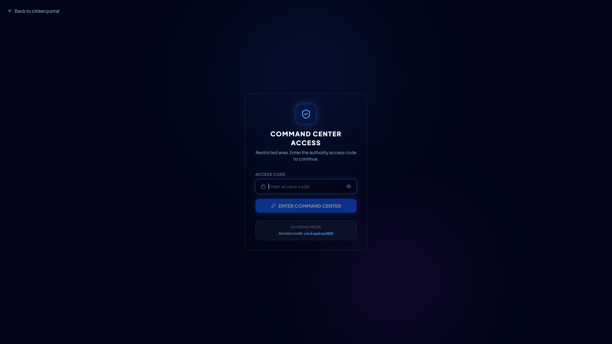
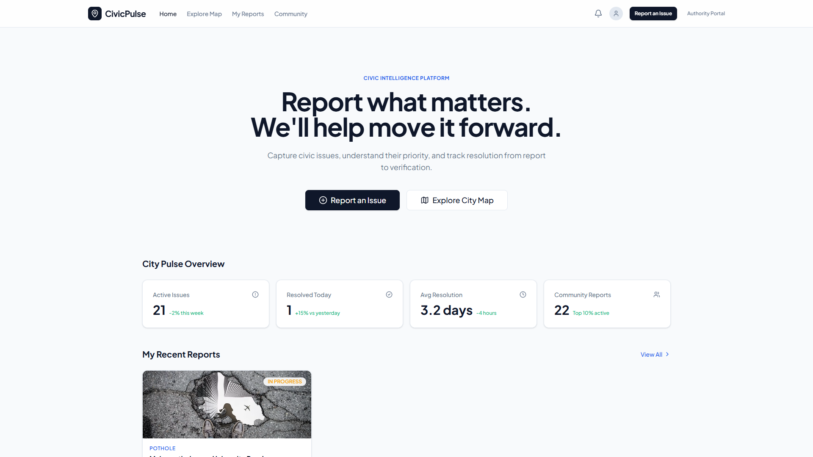

<!-- SLIDE 1 -->
  
# 📍 CIVICPULSE

"Turn citizen reports into coordinated action."

  

    <h3>Problem Statement</h3>
    
<strong>ID:</strong> SIH26043

    
A digital platform to crowdsource societal challenges and facilitate collaborative problem solving through universities and industry partnerships.

    
<strong>Theme:</strong> Disaster Management   <strong>Category:</strong> Software

  

  

    <h3>Team Xieron</h3>
    
<strong>Team Leader:</strong> Mandhir Sawarn

     
    
TEKATHON 5.0 / SIH 2026 Submission

  

---

<!-- SLIDE 2 -->
<h2>CivicPulse — From Citizen Report to Coordinated Resolution</h2>

  

    <h3>The Problem</h3>
    
Citizens encounter civic and societal problems daily, but reporting, prioritization, routing, and follow-up can be highly fragmented and opaque.

    
    <h3>Why CivicPulse?</h3>
    
<strong>Not just complaint registration.</strong> Transforms scattered reports into structured, prioritized civic challenges.

    
    <h3>Key Differentiators</h3>
    <ul style="font-size: 16px; line-height: 1.4;">
      <li><strong>AI-assisted analysis:</strong> Severity & classification</li>
      <li><strong>Geographic intelligence:</strong> Hotspot & cluster detection</li>
      <li><strong>Department routing:</strong> Automated assignments</li>
      <li><strong>Resolution verification:</strong> Citizen loop closure</li>
    </ul>
  

  

    <h3 style="color: #166534; margin-top: 0;">Resolution Workflow</h3>
    

      
📱 REPORT (Citizen)

      
↓

      
🤖 AI ANALYZE (Severity & Category)

      
↓

      
📍 GEO-TAG & CLUSTER (GIS)

      
↓

      
🚦 ROUTE (Assign to Department)

      
↓

      
✅ RESOLVE & VERIFY

    

  

---

<!-- SLIDE 3 -->
<h2>Technical Approach</h2>

  

    <h3>Implementation Stack</h3>
    
Built on a modern, modular, and extremely fast web architecture.

    
    

      React 19
      TypeScript
      Vite
      Tailwind CSS
      Zustand
      React Leaflet
      Recharts
      Framer Motion
    

    <h3>Architecture & AI Layer</h3>
    

      <strong>CITIZEN (React)</strong> → <strong>API (Zustand Store)</strong> → <strong>GIS (Leaflet)</strong> → <strong>AUTHORITY (React)</strong>
    

    
    <ul style="font-size: 16px;">
      <li><strong>AI Layer:</strong> Simulates issue classification and severity assessment.</li>
      <li><strong>GIS Layer:</strong> Real-time geographic clustering and field team routing.</li>
    </ul>
  

  
  

    

      GIS COMMAND CENTER
      
    

    

      CITIZEN PORTAL
      
    

  

---

<!-- SLIDE 4 -->
<h2>Feasibility & Viability</h2>

  

    <h3>Technical Feasibility</h3>
    <ul style="font-size: 16px;">
      <li><strong>Web-based architecture:</strong> No installation required, high accessibility.</li>
      <li><strong>Modular frontend:</strong> Clean separation of Citizen and Admin portals.</li>
      <li><strong>GIS Integration:</strong> OpenStreetMap for zero-cost scalability.</li>
    </ul>
    
    <h3>Operational & Scalability</h3>
    <ul style="font-size: 16px;">
      <li><strong>Workflow:</strong> Seamless handoff from Citizen → Authority → Field Team.</li>
      <li><strong>Expansion Path:</strong> City → Zone → Ward → Multiple Municipalities.</li>
    </ul>
  

  

    <h3>Risks & Mitigation</h3>
    <table style="font-size: 14px;">
      <tr>
        <th>Risk</th>
        <th>Mitigation</th>
      </tr>
      <tr>
        <td><strong>Duplicate reports</strong></td>
        <td>AI similarity + geographic clustering logic</td>
      </tr>
      <tr>
        <td><strong>Incorrect AI categorization</strong></td>
        <td>Human review / authority override capability</td>
      </tr>
      <tr>
        <td><strong>False / low-quality reports</strong></td>
        <td>Photo evidence + moderation + verification</td>
      </tr>
      <tr>
        <td><strong>Location inaccuracies</strong></td>
        <td>Device GPS + manual map correction</td>
      </tr>
      <tr>
        <td><strong>AI hallucination errors</strong></td>
        <td>Human-in-the-loop validation checkpoints</td>
      </tr>
    </table>
  

---

<!-- SLIDE 5 -->
<h2>Impact & Benefits</h2>

  Citizen → CivicPulse Platform → Authorities / Partners → Resolution

  

    <h3 style="margin-top:0;">Citizens & Communities</h3>
    <ul style="font-size: 16px;">
      <li>Simple, geo-tagged reporting</li>
      <li>Transparent tracking & notifications</li>
      <li>Collective problem visibility</li>
      <li>Reduction of duplicate complaints</li>
    </ul>
  

  

    <h3 style="margin-top:0;">Authorities</h3>
    <ul style="font-size: 16px;">
      <li>Prioritized workload & severity</li>
      <li>Geographic hotspot visibility</li>
      <li>Better resource/team allocation</li>
      <li>Clear SLA monitoring</li>
    </ul>
  

  

    <h3 style="margin-top:0;">Universities</h3>
    <ul style="font-size: 16px;">
      <li>Access to real-world civic challenges</li>
      <li>Research & student innovation opportunities</li>
    </ul>
  

  

    <h3 style="margin-top:0;">Industry</h3>
    <ul style="font-size: 16px;">
      <li>Technology partnerships & pilot solutions</li>
      <li>Implementation opportunities for smart cities</li>
    </ul>
  

  "CivicPulse creates a shared intelligence layer between citizens, authorities and solution partners."

---

<!-- SLIDE 6 -->
<h2>Research, References & Prototype</h2>

  

    <h3>Research & References</h3>
    <ul style="font-size: 16px; line-height: 1.6;">
      <li><strong>Problem Statement SIH26043:</strong> Ministry directives on digital crowdsourcing.</li>
      <li><strong>Smart City Frameworks:</strong> Municipal digital governance best practices and open-data standards.</li>
      <li><strong>Spatial Intelligence:</strong> Academic research on GIS clustering and geographic hotspot detection for urban issues.</li>
      <li><strong>AI in Civic Tech:</strong> Methodologies for automated severity assessment and image-based issue classification.</li>
      <li><strong>Participatory Design:</strong> Studies on citizen engagement, loop-closure, and crowdsourcing platforms.</li>
    </ul>
  

  
  

    <h3 style="color: white; font-size: 28px; margin-bottom: 20px;">PROTOTYPE DEMO</h3>
    
Watch the working CivicPulse prototype

    
    <a href="https://youtu.be/ge4P2ygn7ZM" style="display: inline-block; background: #ef4444; color: white; padding: 15px 30px; border-radius: 30px; font-weight: 800; font-size: 20px; text-decoration: none; box-shadow: 0 4px 15px rgba(239, 68, 68, 0.4);">
      ▶ WATCH PROTOTYPE VIDEO
    </a>
  

